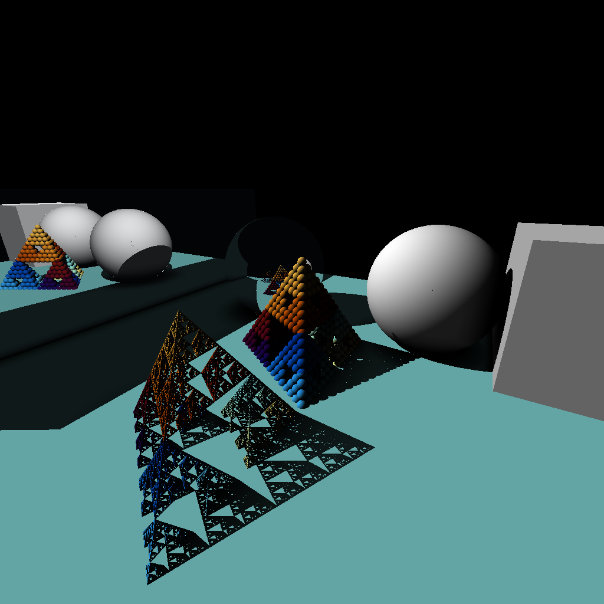

# Distance-aided Ray Marching

Task: visualization of a scene whose objects are represented as a function of distance with sign (SDF).

## TODO

- [x] 3D Sierpinski triangle (CPU)
- [x] Transfer to GPU
- [ ] Supersampling
- [x] Shadows
- [x] Settings for camera position
- [x] Reflection
- [x] Ambient Occlusion
- [x] Unique color for each object
- [x] kernel_slicer usage



## Build

### CPU

```
mkdir build && cd build
```
```
cmake -GNinja -DCMAKE_BUILD_TYPE=Release ..
```
```
cmake --build . -j8
```
### GPU
This will download, build and use kernel_slicer automatically, so no addition actions required.

```
mkdir build && cd build
```
```
cmake -GNinja -DBUILD_WITH_KERNEL_SLICER=ON -DCMAKE_BUILD_TYPE=Release ..
```
```
cmake --build . -j8
```
### GPU (Legacy)
Original way to build with kernel slicer.
1. clone and build kernel_slicer (https://github.com/Ray-Tracing-Systems/kernel_slicer) in some directory
2. find and use VS Code config 'Launch (LiteRF)' in 'kernel_slicer/.vscode/launch.json':
   * you need to change all paths to your LiteRF sources
   * launch kernel_slicer with this config
   * you can make you own command line script if don't like VS Code configs
3. build shaders:
   * cd example_tracer/shaders_generated && bash build.sh
   * or use record 'Build Shaders (GLSL, example_tracer)' in vs code config 'tasks.json': just press 'Ctr+Shift+B'
4. use Cmake to build project with 'USE_VULKAN' flag == 'ON':
   * mkdir cmake-build-release && cd cmake-build-release
   * cmake -DCMAKE_BUILD_TYPE=Release -DUSE_VULKAN=ON ..
   * make -j 8
   * Note that the program will seek for 'example_tracer/shaders_generated/kernel2D_RayMarch.comp.spv' 
   * Therefore you have to run it from LiteRF root folder (what is done by default in VS Code config) or copy appropriate SPIR-V file to get 'cmake-build-release/example_tracer/shaders_generated/kernel2D_RayMarch.comp.spv'

#### kernel slicer cmd line

```
<kslicer-build-dir>/kslicer <cur-src-dir>/tracer/tracer.cpp -mainClass RayMarcherExample -shaderCC glsl -pattern ipv -DKERNEL_SLICER -v -I<cur-build-dir>/_deps/litemath-src/ ignore -I<kslicer-rep-path>/kernel_slicer/TINYSTL ignore -stdlibfolder <kslicer-rep-path>/kernel_slicer/TINYSTL
```

For example:
```
./cmake-build-debug/kslicer /home/ddrozdov/Documents/repos/MSU-NAIR-2024S/task1/tracer/tracer.cpp -mainClass RayMarcherExample -shaderCC glsl -pattern ipv -DKERNEL_SLICER -v -I/home/ddrozdov/Documents/repos/MSU-NAIR-2024S/task1/build-gpu/_deps/litemath-src/ ignore -I/home/ddrozdov/Documents/repos/kernel_slicer/TINYSTL ignore -stdlibfolder /home/ddrozdov/Documents/repos/kernel_slicer/TINYSTL
```

